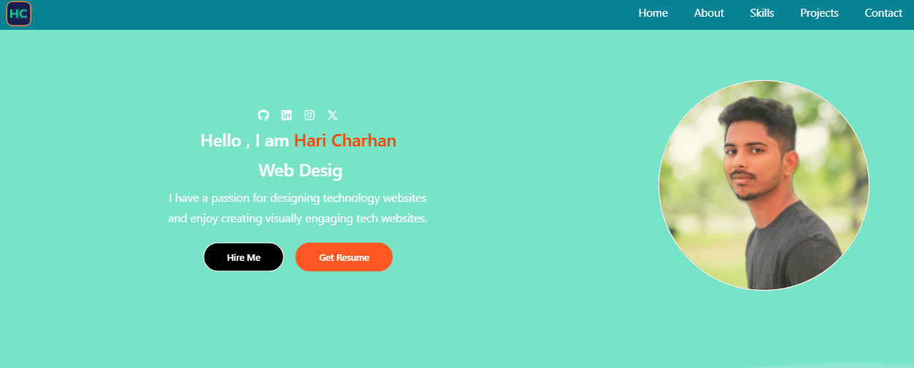

---

# 🖥️ Hari Charhan's Portfolio

Welcome to my personal portfolio! This is where I showcase my skills, projects, and the journey I've taken in the world of web development. Dive in to explore my work and learn more about what I do!

## 🚀 About Me

I’m a passionate full-stack web developer with a knack for creating dynamic and responsive web applications. My focus lies in building efficient, scalable, and user-friendly applications. I’m always eager to learn and grow, embracing new challenges that push the boundaries of my knowledge.

## 🌟 Features

- **Modern Design**: Clean and minimalistic design for a professional appearance.
- **Responsive Layout**: Fully responsive design that looks great on any device.
- **Interactive Elements**: Engaging user experience with smooth animations and transitions.
- **Dynamic Content**: Display of various projects with details and live demos.

## 🛠️ Technologies Used

- **Frontend**: React, HTML5, CSS3, JavaScript, Tailwind CSS
- **Version Control**: Git, GitHub
- **Deployment**: Netlify

## 📂 Projects

### [Hand Gesture Media Player]

A brief description of the project. Built using Python with vision software. [GitHub](https://github.com/Haricharhan/Controlling-Media-player-Using-Hand-Gesture/tree/main)

### [2048 Game]

A fun and interactive browser-based 2048 puzzle game built with HTML, CSS, and JavaScript. Challenge yourself to combine tiles and reach the 2048 tile! [GitHub](https://github.com/Haricharhan/2048-Game) | [Live Demo](https://haricharhan-2048game.netlify.app)

### [Portfolio]

A brief description of the project. Built using React, Tailwind CSS, and more. [Live Demo](https://haricharhan-2048game.netlify.app)

## 📸 Screenshots

  

## 📫 Contact

- **LinkedIn**: [linkedin.com/in/hari-charhan-9a5b88274](https://linkedin.com/in/hari-charhan-9a5b88274)
- **Email**: bolluharicharhan@gmail.com

## 📝 License

This project is licensed under the MIT License - see the [LICENSE](./LICENSE) file for details.

---
